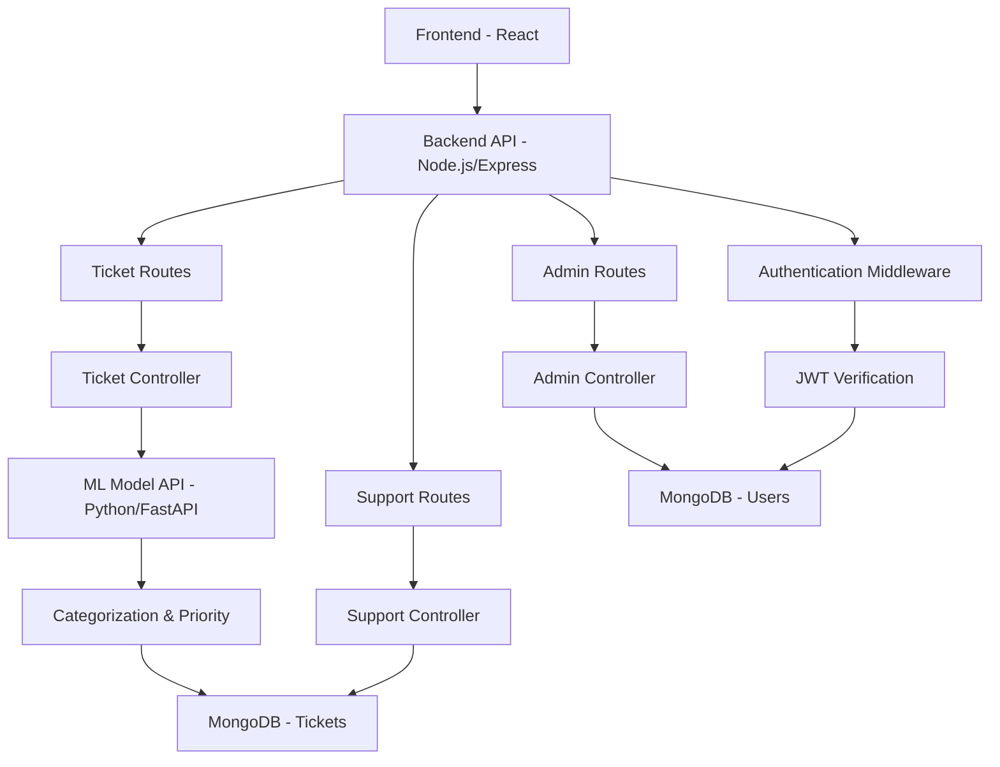

# AI Ticket Project

A comprehensive role-based ticket management system built with a modern tech stack, featuring AI-powered ticket categorization, user authentication, ticket creation, status tracking, and administrative controls. Includes a machine learning component for automatic ticket classification and prioritization.

## Features

- **Role-Based Access Control**: Supports Admin, Support, and User roles with different permissions
- **User Authentication**: JWT-based authentication with secure password hashing
- **Ticket Management**: Create, view, update, and track tickets with status progression
- **AI-Powered Categorization**: Ticket category and priority are automatically determined by machine learning models based on ticket content
- **Admin Dashboard**: User management, ticket oversight, and system statistics
- **Support Interface**: Dedicated tools for support staff to manage tickets
- **Responsive Design**: Mobile-friendly interface built with React and Tailwind CSS
- **Real-time Updates**: State management with Zustand for seamless user experience

## AI/ML Integration

The system incorporates machine learning models to automatically categorize tickets and assign priority levels based on the ticket's title and description. This helps in efficient routing and prioritization of support requests.

## Tech Stack

### Backend
- **Node.js** with **Express.js** framework
- **MongoDB** with **Mongoose** ODM
- **JWT** for authentication
- **bcryptjs** for password hashing
- **express-validator** for input validation

### Frontend
- **React 19** with **Vite** build tool
- **Tailwind CSS** for styling
- **React Router** for navigation
- **Zustand** for state management
- **React Toastify** for notifications
- **Heroicons** and **Lucide React** for icons
- **jsPDF** for PDF generation

### AI/ML Component
- **Python** with **FastAPI** framework
- **scikit-learn**: Machine learning library
- **pandas**: Data manipulation
- **numpy**: Numerical computing
- **TF-IDF Vectorization**: Text feature extraction
- **SVM & Logistic Regression**: Classification models

## Project Structure

```
AI_TICKET_PROJECT/
├── backend/
│   ├── config/
│   │   └── database.js
│   ├── middleware/
│   │   └── auth.js
│   ├── models/
│   │   ├── Ticket.js
│   │   └── User.js
│   ├── routes/
│   │   ├── admin.js
│   │   ├── auth.js
│   │   ├── support.js
│   │   └── tickets.js
│   ├── .env
│   ├── package.json
│   ├── server.js
│   └── ...
├── frontend/
│   ├── public/
│   ├── src/
│   │   ├── components/
│   │   │   ├── admin/
│   │   │   ├── dashboard/
│   │   │   └── ...
│   │   ├── pages/
│   │   ├── stores/
│   │   └── ...
│   ├── package.json
│   ├── vite.config.js
│   └── ...
├── MLModel/
│   ├── data/
│   │   ├── raw/           # Raw dataset files
│   │   └── processed/     # Cleaned and processed data
│   ├── models/            # Trained ML models and encoders
│   ├── src/
│   │   ├── main.py        # FastAPI application
│   │   ├── predict.py     # Prediction logic
│   │   ├── train.py       # Model training script
│   │   ├── preprocessing.py # Data preprocessing utilities
│   │   └── evaluate.py    # Model evaluation
│   ├── requirements.txt   # Python dependencies
│   ├── Procfile          # Deployment configuration for Render
│   ├── runtime.txt       # Python version specification
│   └── README.md         # ML Model documentation
└── README.md
```

## Installation

### Prerequisites
- Node.js (v16 or higher)
- Python (3.8 or higher)
- MongoDB (local or cloud instance)
- npm or yarn

### Backend Setup

1. Navigate to the backend directory:
   ```bash
   cd backend
   ```

2. Install dependencies:
   ```bash
   npm install
   ```

3. Create a `.env` file in the backend directory with the following variables:
   ```
   PORT=8000
   MONGODB_URI=mongodb://localhost:27017/ticket_management
   JWT_SECRET=your_jwt_secret_key_here
   ```

4. Start the backend server:
   ```bash
   npm run dev
   ```

### Frontend Setup

1. Navigate to the frontend directory:
   ```bash
   cd frontend
   ```

2. Install dependencies:
   ```bash
   npm install
   ```

3. Create a `.env` file in the frontend directory with the backend URL:
   ```
   VITE_API_BASE_URL=https://ai-ticket-creation-backend.onrender.com
   ```
   For local development, you can use `VITE_API_BASE_URL=http://localhost:8000`

4. Start the development server:
   ```bash
   npm run dev
   ```

### MLModel Setup

1. Navigate to the MLModel directory:
   ```bash
   cd MLModel
   ```

2. Create a virtual environment:
   ```bash
   python -m venv venv
   source venv/bin/activate  # On Windows: venv\Scripts\activate
   ```

3. Install dependencies:
   ```bash
   pip install -r requirements.txt
   ```

4. Train the models (if not already trained):
   ```bash
   python src/train.py
   ```

5. Start the FastAPI server:
   ```bash
   uvicorn src.main:app --reload
   ```

   The ML API will be available at `http://127.0.0.1:8000`

## Usage

1. **Access the Application**:
   - **Local Development**: Open your browser and navigate to `http://localhost:5173` (default Vite port)
   - **Deployed Version**: Visit `https://ai-ticket-creation.onrender.com`

2. **User Registration/Login**:
   - Register a new account or login with existing credentials
   - Different roles have access to different features

3. **Creating Tickets**:
   - Navigate to the dashboard
   - Fill out the ticket creation form with title and description
   - Submit to create a new ticket

4. **Managing Tickets**:
   - View all tickets in the ticket list
   - Update ticket status (for authorized roles)
   - Filter and search tickets

5. **Admin Features**:
   - Access admin panel for user management
   - View system statistics and reports
   - Manage all tickets across the system

## API Endpoints

### Authentication
- `POST /auth/register` - User registration
- `POST /auth/login` - User login
- `GET /auth/profile` - Get user profile

### Tickets
- `GET /tickets` - Get user's tickets
- `POST /tickets` - Create new ticket
- `PUT /tickets/:id` - Update ticket
- `DELETE /tickets/:id` - Delete ticket

### Admin
- `GET /admin/users` - Get all users
- `PUT /admin/users/:id` - Update user role
- `GET /admin/tickets` - Get all tickets
- `GET /admin/stats` - Get system statistics

### Support
- `GET /support/tickets` - Get tickets assigned to support
- `PUT /support/tickets/:id` - Update ticket status

### ML Model API

The MLModel provides a separate FastAPI service for ticket classification:

- `POST /generate-ticket` - Generate ticket classification

**Request Body**:
```json
{
  "title": "Printer not working",
  "description": "The office printer on floor 3 is not responding to print commands. Error message shows 'connection timeout'."
}
```

**Response**:
```json
{
  "ticket_id": "TCKT-A1B2C3",
  "title": "Printer not working",
  "description": "The office printer on floor 3 is not responding to print commands. Error message shows 'connection timeout'.",
  "category": "Hardware",
  "priority": "High",
  "confidence_level": 0.87,
  "category_distribution": {
    "Hardware": 0.87,
    "Access": 0.08,
    "HR support": 0.05
  }
}
```

**Validation Rules**:
- Description must be between 15-1000 characters
- Minimum confidence threshold: 40%
- Clear, descriptive text improves accuracy

## Development

### Running Tests
```bash
# Backend tests (if implemented)
cd backend
npm test

# Frontend linting
cd frontend
npm run lint
```

### Building for Production
```bash
# Build frontend
cd frontend
npm run build

# Start backend in production
cd backend
npm start
```

### ML Model Training

To retrain models with new data:

1. Place your dataset in `MLModel/data/raw/` as CSV with columns: `text`, `category`, `priority`
2. Update the `DATA_PATH` in `MLModel/src/train.py` if needed
3. Run `python MLModel/src/train.py`

### ML Model Deployment on Render

1. Push your code to GitHub/GitLab:
   ```bash
   git add .
   git commit -m "Ready for deployment"
   git push origin main
   ```

2. Create a new Web Service on Render:
   - Connect your repository
   - Set build command: `pip install -r requirements.txt`
   - Set start command: `uvicorn src.main:app --host 0.0.0.0 --port $PORT`
   - Or use the provided `Procfile`

3. Environment Variables (if needed):
   - No environment variables required for basic functionality

4. Deploy:
   - Render will automatically build and deploy your application
   - Your ML API will be available at the provided Render URL

## Contributing

1. Fork the repository
2. Create a feature branch (`git checkout -b feature/AmazingFeature`)
3. Commit your changes (`git commit -m 'Add some AmazingFeature'`)
4. Push to the branch (`git push origin feature/AmazingFeature`)
5. Open a Pull Request

## License

This project is licensed under the ISC License - see the LICENSE file for details.

## Architecture Overview



## Future Enhancements

- Email notifications for ticket updates
- File attachments for tickets
- Advanced search and filtering
- Real-time notifications with WebSockets
- API documentation with Swagger
- Unit and integration tests
- Docker containerization